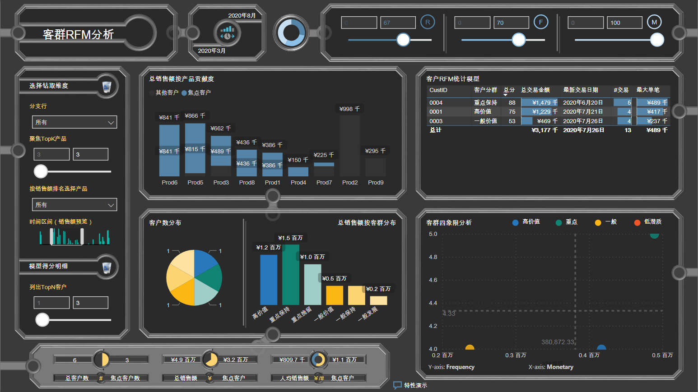
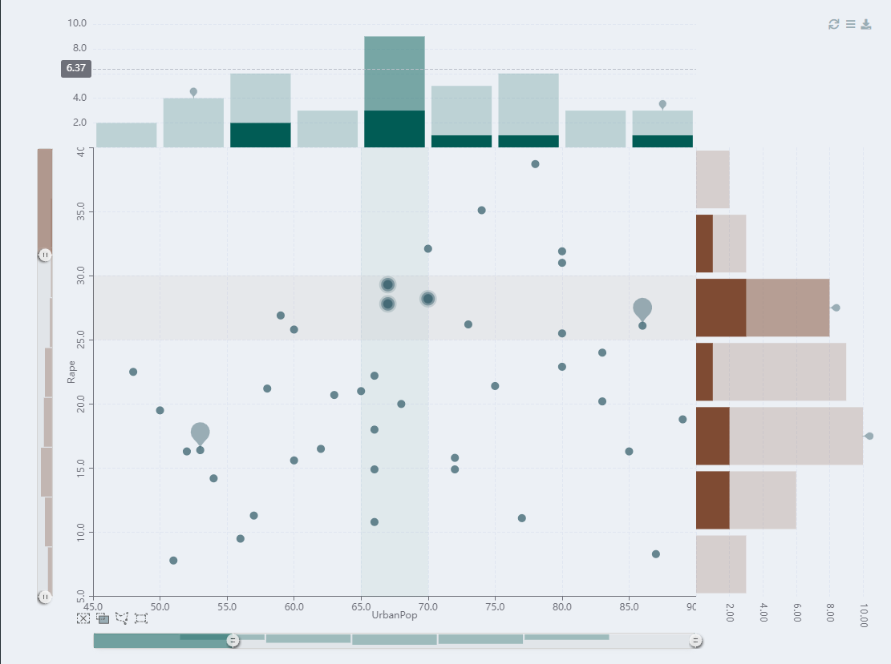

## Welcome to Grilled Robin

<!-- https://stackoverflow.com/questions/1705895/python-markdown-markdown-inside-html-blocks -->
<table border="0" width="100%">
  <tr>
    <td width="80%">
      <h3>Robin Lu</h3>
      
<b>VP @ Foreign Bank</b>

      
<b>Data Structure, Visualization, Business Intelligence, Analytics, RPA</b>

      
:gem: <b>SAS</b>, <b>Python</b>, <b>R</b>, <b>Power BI</b>

    </td>
    <td width="20%" align="center">
      
    </td>
  </tr>
</table>

### News

- [x] `2021-12-26` Launch online app to demonstrate the usage of `Capsule` chart and the function to draw another `echarts` within the tooltip of an existing `echarts`
- [x] `2021-12-12` Add function `echarts4r_Capsule` \([`R` version](https://github.com/GrilledRobin/omni-series/blob/master/R/omniR/Visualization/echarts4r_Capsule.r) \) to create multiple Capsule charts at the same time, displaying min/max/current values for the same categories respectively, which is useful visualizing fund prices within time series data.
- [x] `2021-12-08` Add helper functions `as.character.htmlwidget` \([`R` version](https://github.com/GrilledRobin/omni-series/blob/master/R/omniR/Visualization/as.character.htmlwidget.r) \), `add_datatable_render_code` \([`R` version](https://github.com/GrilledRobin/omni-series/blob/master/R/omniR/Visualization/add_datatable_render_code.r) \), `add_deps` \([`R` version](https://github.com/GrilledRobin/omni-series/blob/master/R/omniR/Visualization/add_deps.r) \) to enable drawing inline html widgets, often as charts, inside the cells of `JQuery` `datatables`. They are especially useful for `R`:`shiny` applications powered by `DT` package.
- [x] `2021-12-04` Slightly improve the efficiency and readability in functions `intnx` \([`R` version](https://github.com/GrilledRobin/omni-series/blob/master/R/omniR/Dates/intnx.r), [`Python` version](https://github.com/GrilledRobin/omni-series/blob/master/Python/omniPy/Dates/intnx.py) \) and `intck` \([`R` version](https://github.com/GrilledRobin/omni-series/blob/master/R/omniR/Dates/intck.r), [`Python` version](https://github.com/GrilledRobin/omni-series/blob/master/Python/omniPy/Dates/intck.py) \) in the sub-module `Dates` of both [`R` branch](https://github.com/GrilledRobin/omni-series/tree/master/R/omniR) and [`Python` branch](https://github.com/GrilledRobin/omni-series/tree/master/Python/omniPy).
- [x] `2021-11-28` Setup my personal homepage
- [ ] `2021-11-28` Upgrade `shiny` module [`UM_custPortMgmt`](https://github.com/GrilledRobin/omni-series/blob/master/R/omniR/UsrShinyModules/Ops/UM_custPortMgmt.r) to support `R 4.1.1` and [`echarts4r 0.4.1`](https://echarts4r.john-coene.com/)
- [x] `2021-11-26` Add function [`setForegroundWindow`](https://github.com/GrilledRobin/omni-series/blob/master/Python/omniPy/RPA/setForegroundWindow.py) to set the dedicated window to the fore-ground in the sub-module `RPA` of [`Python` branch](https://github.com/GrilledRobin/omni-series/tree/master/Python/omniPy).
- [x] `2021-11-23` Correct the datetime part in functions `intnx` \([`R` version](https://github.com/GrilledRobin/omni-series/blob/master/R/omniR/Dates/intnx.r), [`Python` version](https://github.com/GrilledRobin/omni-series/blob/master/Python/omniPy/Dates/intnx.py) \) and `intck` \([`R` version](https://github.com/GrilledRobin/omni-series/blob/master/R/omniR/Dates/intck.r), [`Python` version](https://github.com/GrilledRobin/omni-series/blob/master/Python/omniPy/Dates/intck.py) \) in the sub-module `Dates` of both [`R` branch](https://github.com/GrilledRobin/omni-series/tree/master/R/omniR) and [`Python` branch](https://github.com/GrilledRobin/omni-series/tree/master/Python/omniPy).
- [x] `2021-11-21` Introduce program templates to utilize all my packages \(currently available as source codes\) designed as omni-series for easy reference. [`R` version](https://github.com/GrilledRobin/omni-series/tree/master/R/Programs), [`Python` version](https://github.com/GrilledRobin/omni-series/tree/master/Python/Programs)
- [x] `2021-11-07` Add function `winKnownFolders` \([`Python` version](https://github.com/GrilledRobin/omni-series/blob/master/Python/omniPy/FileSystem/winKnownFolders.py) \) to simulate the function [`SHGetKnownFolderPath`](https://docs.microsoft.com/en-us/windows/win32/api/shlobj_core/nf-shlobj_core-shgetknownfolderpath) in `C#`, with helper function `getMSDNKnownFolderIDDoc` \([`Python` version](https://github.com/GrilledRobin/omni-series/blob/master/Python/omniPy/FileSystem/getMSDNKnownFolderIDDoc.py) \) to scrape the maping table from MSDN.
- [x] `2021-10-17` Upgrade `shiny` module [`UM_JointPlots`](https://github.com/GrilledRobin/omni-series/blob/master/R/omniR/UsrShinyModules/Stats/UM_JointPlots.r) to support `R 4.1.1` and [`echarts4r 0.4.1`](https://echarts4r.john-coene.com/), demo snapshot for the module is [here](assets/images/demo_UM_JointPlots.png)

### Gallery

Some of my projects are demonstrated in this section

#### Customizable RFM

`RFM` \(Recency-Frequency-Monetary\) model is a classic stats model to classify the customers in terms of the transactions that are conducted on different time spans and monetary amount. Here I launched a project with `MS Power BI` to visualize the modeling by providing below features:
- Filter the source data by various dimensions while refresh the result **immediately**
- Adjust the weights of all 3 keys on the run
- Refresh the customer distribution in various dimensions
- Identify the concentration rate of each customer group
- Export the targeted customer list for further actions to be taken in Frontline; which is also the primary goal of this project: provide **direct** support with sufficient data to Frontline while reducing internal communication cost

#### `R` `echarts4r` package application: Fund Price

This project is to visualize the fund prices along the timeline with below features:
- Show inline `echarts` within `DT::datatable`
- Draw another `echarts` object within the tooltip of an existing `echarts` object
- Design a `Capsule` chart for each fund, showing the minimum and maximum prices among all historical data on a bar, with a symbol representing the position of the latest price between them
- The color of the `Capsule` chart can be differentiated out of a model, depicting whether the fund is worth investing at present on certain hypothesis
- When hovering the mouse on the symbol, show a tooltip with the whole history of price change for the same fund
- Within the tooltip, add buttons to control the zooming, resembling most of the stock softwares

<iframe
  height=400
  width=95%
  src="https://grilledrobin.shinyapps.io/fundprice/"
  frameborder=0
  allowfullscreen>
</iframe>

#### `R` `shiny` Module: Joint Plots

This project resembles the [`seaborn.jointplot`](http://seaborn.pydata.org/generated/seaborn.jointplot.html) using `R` language and provides below features:
- Slices on by <em>x</em> and <em>y</em> axes, to filter on either or both
- Enable `brushing` features provided by [`echarts4r 0.4.1`](https://echarts4r.john-coene.com/)
- Customize colors for 3 sub-charts respectively
- Provides the function to export the snapshot as a standalone `html file` of the interaction result, for offline sharing; while the template can also be customized using `R markdown`

### Contact

:iphone: **+86-137-7435-7860**  
:email: r.b.lucas@hotmail.com
